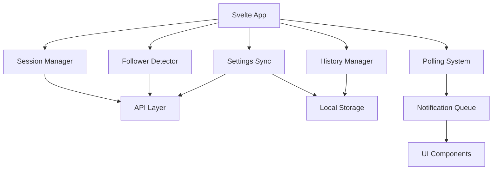

# Design Document: Svelte Functionality Fix

## Overview

This design addresses critical functionality gaps in the Svelte version of the Fazzk application by implementing robust session management, follower detection, settings synchronization, and error handling systems. The solution ensures feature parity with the vanilla JS version while maintaining Svelte's reactive architecture.

## Architecture

The system follows a modular architecture with clear separation of concerns:



## Components and Interfaces

### Session Manager
```typescript
interface SessionManager {
  sessionError: boolean
  isReconnecting: boolean
  reconnectAttempts: number
  maxReconnectAttempts: number
  
  handleSessionError(): void
  attemptReconnect(): Promise<void>
  clearErrorStates(): void
}
```

### Follower Detector
```typescript
interface FollowerDetector {
  knownFollowers: Set<string>
  appStartedAt: number
  isFetching: boolean
  
  initializeKnownFollowers(followers: Follower[]): void
  detectNewFollowers(followers: Follower[]): Follower[]
  isOldFollower(follower: Follower): boolean
}
```

### Settings Sync
```typescript
interface SettingsSync {
  loadSettings(): Promise<Settings>
  saveSettings(settings: Settings): Promise<void>
  applyUrlOverrides(settings: Settings): Settings
}
```

### History Manager
```typescript
interface HistoryManager {
  history: HistoryItem[]
  maxHistorySize: number
  
  addToHistory(follower: Follower): void
  loadHistory(): void
  clearHistory(): void
  formatTimestamp(timestamp: string): string
}
```

## Data Models

### Settings Model
```typescript
interface Settings {
  volume: number
  pollingInterval: number
  displayDuration: number
  enableTTS: boolean
  customSoundPath: string | null
  animationType: 'fade' | 'slide-up' | 'slide-down' | 'bounce'
  textColor: string
  textSize: number
}
```

### Follower Model
```typescript
interface Follower {
  user: {
    userIdHash: string
    nickname: string
    profileImageUrl: string
  }
  followingSince: string
}
```

### History Item Model
```typescript
interface HistoryItem extends Follower {
  _id: string
  notifiedAt: string
}
```

## Correctness Properties

*A property is a characteristic or behavior that should hold true across all valid executions of a system-essentially, a formal statement about what the system should do. Properties serve as the bridge between human-readable specifications and machine-verifiable correctness guarantees.*

### Property 1: Session Error Handling
*For any* HTTP response with 401 or 403 status code, the Session Manager should set the session error state to true and display an appropriate error message
**Validates: Requirements 1.1**

### Property 2: Automatic Reconnection
*For any* session error when reconnection attempts are below maximum, the Session Manager should automatically initiate a reconnection attempt
**Validates: Requirements 1.2**

### Property 3: Reconnection Status Display
*For any* active reconnection process, the Session Manager should display the reconnection status with the current attempt count
**Validates: Requirements 1.3**

### Property 4: Reconnection Success Cleanup
*For any* successful reconnection, the Session Manager should clear all error states and resume normal operation
**Validates: Requirements 1.5**

### Property 5: Initial Follower Loading
*For any* set of existing followers during initial load, the Follower Detector should add them to the known followers set without triggering notifications
**Validates: Requirements 2.2**

### Property 6: Old Follower Filtering
*For any* follower whose following time is before the app start time, the Follower Detector should ignore that follower as old
**Validates: Requirements 2.3**

### Property 7: Duplicate Follower Prevention
*For any* follower already in the known followers set, the Follower Detector should not add them to the notification queue
**Validates: Requirements 2.4**

### Property 8: Race Condition Prevention
*For any* simultaneous polling requests, the Follower Detector should prevent race conditions by allowing only one fetch operation at a time
**Validates: Requirements 2.5**

### Property 9: Settings Fallback
*For any* server settings loading failure, the Settings Sync should fallback to local storage settings
**Validates: Requirements 3.2**

### Property 10: URL Parameter Override
*For any* URL parameters present, the Settings Sync should override loaded settings with the URL parameter values
**Validates: Requirements 3.3**

### Property 11: Dual Settings Save
*For any* settings save operation, the Settings Sync should save to both server and local storage
**Validates: Requirements 3.4**

### Property 12: Settings Save Error Handling
*For any* server save failure, the Settings Sync should still save to local storage and log the error
**Validates: Requirements 3.5**

### Property 13: History Addition
*For any* new follower notification, the History Manager should add the follower to history with a timestamp
**Validates: Requirements 4.1**

### Property 14: History Loading Error Handling
*For any* history loading operation, the History Manager should handle errors gracefully and restore valid data from local storage
**Validates: Requirements 4.2**

### Property 15: History Size Management
*For any* history that exceeds the maximum size of 50 items, the History Manager should remove the oldest items
**Validates: Requirements 4.3**

### Property 16: Complete History Clearing
*For any* history clear operation, the History Manager should remove all items from both memory and local storage
**Validates: Requirements 4.4**

### Property 17: Korean Timestamp Formatting
*For any* timestamp in history display, the History Manager should format it in Korean locale
**Validates: Requirements 4.5**

### Property 18: Network Error Recovery
*For any* network error during polling, the Polling System should log the error and continue with the next scheduled poll
**Validates: Requirements 6.1**

### Property 19: Settings Loading Fallback
*For any* settings loading failure, the Svelte App should use default values and show an appropriate message
**Validates: Requirements 6.2**

### Property 20: Audio Playback Error Handling
*For any* audio playback failure, the Svelte App should log the error but continue with other notification features
**Validates: Requirements 6.3**

### Property 21: TTS Fallback
*For any* TTS failure, the Svelte App should continue with audio notification
**Validates: Requirements 6.4**

### Property 22: File Selection Error Handling
*For any* file selection failure, the Svelte App should show an error message and maintain current settings
**Validates: Requirements 6.5**

### Property 23: Sequential Notification Queuing
*For any* multiple followers detected simultaneously, the Svelte App should queue them for sequential display
**Validates: Requirements 7.1**

### Property 24: Notification Display Sequencing
*For any* notification currently being displayed, the Svelte App should wait for completion before showing the next
**Validates: Requirements 7.2**

### Property 25: Display Duration Management
*For any* notification display duration expiration, the Svelte App should clear the current notification and process the next in queue
**Validates: Requirements 7.3**

### Property 26: Queue Empty State Management
*For any* empty notification queue, the Svelte App should set the processing state to false
**Validates: Requirements 7.4**

### Property 27: Queue Error Recovery
*For any* notification display failure, the Svelte App should still process remaining queue items
**Validates: Requirements 7.5**

### Property 28: Immediate Theme Updates
*For any* theme toggle, the Svelte App should update the document theme attribute immediately
**Validates: Requirements 8.1**

### Property 29: Theme Persistence
*For any* theme change, the Svelte App should save the preference to local storage
**Validates: Requirements 8.2**

### Property 30: Custom Text Color Application
*For any* custom text color setting, the Svelte App should apply it to notification text
**Validates: Requirements 8.4**

### Property 31: Text Size Updates
*For any* text size change, the Svelte App should update the font size percentage on the document body
**Validates: Requirements 8.5**

## Error Handling

### Error Categories
1. **Network Errors**: Connection failures, timeouts, server errors
2. **Session Errors**: Authentication failures, expired tokens
3. **Data Errors**: Malformed responses, missing fields
4. **UI Errors**: Audio playback failures, file selection errors
5. **Storage Errors**: Local storage access failures

### Error Recovery Strategies
- **Retry with Backoff**: For transient network errors
- **Graceful Degradation**: Continue with reduced functionality
- **User Notification**: Clear error messages with actionable steps
- **State Cleanup**: Reset error states after successful recovery

## Testing Strategy

### Dual Testing Approach
- **Unit tests**: Verify specific examples, edge cases, and error conditions
- **Property tests**: Verify universal properties across all inputs
- Both are complementary and necessary for comprehensive coverage

### Property-Based Testing Configuration
- Use fast-check library for TypeScript/JavaScript property testing
- Configure each test to run minimum 100 iterations
- Tag each test with: **Feature: svelte-functionality-fix, Property {number}: {property_text}**

### Unit Testing Focus
- Specific examples that demonstrate correct behavior
- Integration points between components
- Edge cases like maximum reconnection attempts
- Error conditions and recovery scenarios

### Property Testing Focus
- Universal properties that hold for all inputs
- Comprehensive input coverage through randomization
- Session management across various error scenarios
- Settings synchronization with random data
- Follower detection with generated follower sets